# 🌟 python-star-pattern 🌟

Welcome to **python-star-pattern**!  
A fun and interactive collection of Python programs to print various star (asterisk) patterns.  
Perfect for beginners who want to master loops, conditionals, and creative output formatting!

<br> <br>

## 📝 About Star Patterns

**Star patterns** are visual arrangements of asterisks (`*`) printed using code.  
They are a classic way to practice programming fundamentals such as loops, conditional statements, and nested structures.  
Typical patterns include squares, triangles, pyramids, diamonds, and more – each helping you understand how to control code flow and output formatting.


<br> <br>

## 🖼️ Screenshots
### for code check patterns.ipynb

| 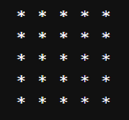 | 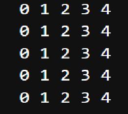 | 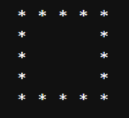 | 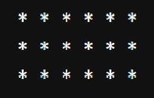 |
|---------------------------------------------|---------------------------------------------|---------------------------------------------|---------------------------------------------|
| 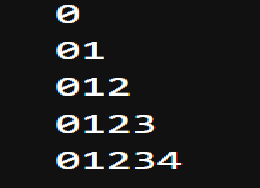 | 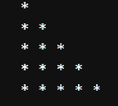 | 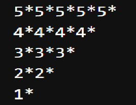 | 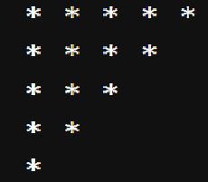 |
| 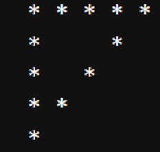 | 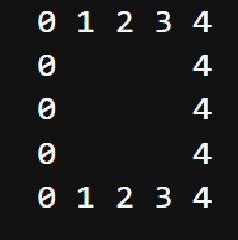 | 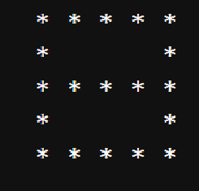 | 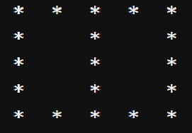 |
| 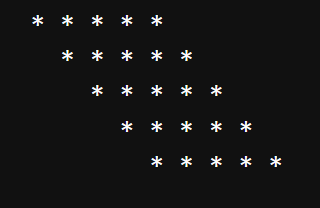 | 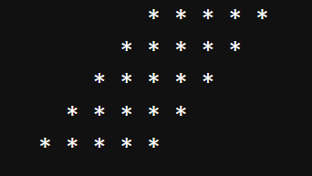 | 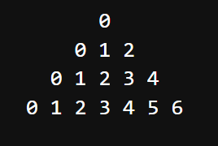 | 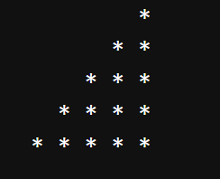 |
| 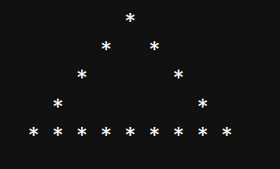 | 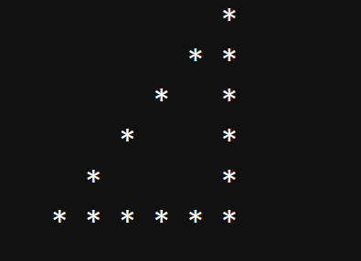 | 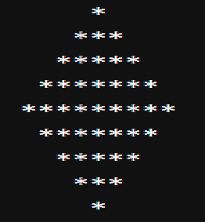 |                                             |


<br> <br>


## 🚀 Getting Started

1. **Clone the repository**  
   ```bash
   git clone https://github.com/PawanCodeCrafts/python-star-pattern.git
   ```
2. **Navigate to the folder**
   ```bash
   cd python-star-pattern
   ```
3. **Run the pattern file**
   ```bash
   python pattern_filename.py
   ```

<br> <br>


Happy Coding!  
🌠✨🌟
---
made with ❤ by Pawan
